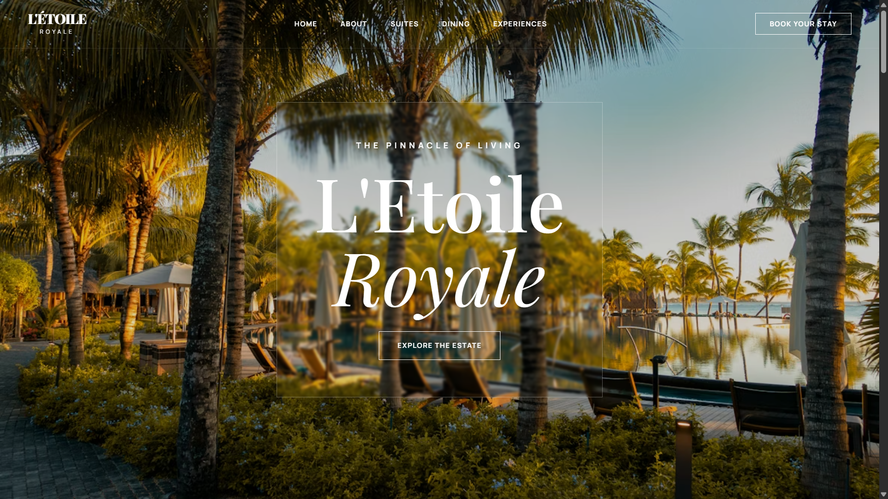

<div align="center">

# ⭐ L'Etoile Royale

### 🏨 Luxury Parisian Hotel Experience

*A premium, five-star hotel website with elegant cream aesthetics and terracotta accents*

[](https://letoile-saas.vercel.app)
[](https://github.com/panduthegang/Letoile-Saas)
[](LICENSE)

</div>

---

<div align="center">
  
</div>

---

## 🎯 Overview

**L'Etoile Royale** is a luxurious, five-star hotel website showcasing the pinnacle of Parisian hospitality. Built with modern web technologies, it features smooth parallax animations, elegant serif typography, and a premium cream-mode aesthetic with terracotta accents.

---

## 🛠️ Tech Stack

<div align="center">

| Technology | Description |
|:---:|:---|
|  | Frontend UI Library |
|  | Type-Safe JavaScript |
|  | Next-Gen Build Tool |
|  | Utility-First CSS |
|  | Animation Library |
|  | Client-Side Routing |

</div>

---

## ✨ Features

<table>
<tr>
<td width="50%">

### 🎨 Design & UI
- 🍦 **Cream Mode Aesthetic** - Elegant warm theme
- 🔶 **Terracotta Accents** - Premium color palette
- 🖋️ **Editorial Typography** - Playfair Display & Cormorant
- 📱 **Fully Responsive** - Mobile-first design
- 🎭 **Parallax Animations** - Smooth scroll effects

</td>
<td width="50%">

### 🚀 Functionality
- 🧭 **Multi-Page Navigation** - React Router integration
- 🛏️ **Suites Showcase** - Premium room collection
- 🖼️ **Royal Gallery** - Art collection section
- 💬 **Testimonials** - Guest reviews section
- ❓ **Interactive FAQ** - Accordion component
- 🎠 **Marquee Banner** - Animated text scroll

</td>
</tr>
</table>

---

## 📂 Project Structure

```
📁 Letoile-Saas/
├── 📁 public/
│   ├── 🖼️ Thumbnail.png          # Social media preview image
│   └── 🎨 logo.svg                # Brand logo (SVG)
│
├── 📁 src/
│   ├── 📁 components/
│   │   ├── 📄 Navbar.tsx          # Navigation with mobile menu
│   │   ├── 📄 Footer.tsx          # Site footer with links
│   │   ├── 📄 Button.tsx          # Reusable button component
│   │   ├── 📄 Accordion.tsx       # FAQ accordion component
│   │   ├── 📄 Marquee.tsx         # Animated scrolling text
│   │   ├── 📄 Reveal.tsx          # Scroll reveal animation
│   │   └── 📄 ParallaxImage.tsx   # Parallax image effect
│   │
│   ├── 📁 pages/
│   │   ├── 📄 LandingPage.tsx     # Homepage with hero, rooms, testimonials
│   │   ├── 📄 AboutPage.tsx       # Hotel story & philosophy
│   │   └── 📄 SuitesPage.tsx      # Premium suites showcase
│   │
│   ├── 📄 App.tsx                 # Root component with routing
│   ├── 📄 main.tsx                # React entry point
│   ├── 📄 types.ts                # TypeScript interfaces
│   └── 🎨 index.css               # Global styles & Tailwind
│
├── 📄 index.html                  # HTML template with meta tags
├── 📄 package.json                # Dependencies & scripts
├── 📄 tailwind.config.js          # Tailwind customization
├── 📄 vite.config.ts              # Vite configuration
├── 📄 vercel.json                 # Vercel SPA routing config
├── 📄 tsconfig.json               # TypeScript config
└── 📄 README.md                   # You are here! 👋
```

---

## 🚀 Getting Started

### Prerequisites

- **Node.js** (v18 or higher)
- **npm** or **yarn**

### Installation

1️⃣ **Clone the repository**
```bash
git clone https://github.com/panduthegang/Letoile-Saas.git
cd Letoile-Saas
```

2️⃣ **Install dependencies**
```bash
npm install
```

3️⃣ **Start development server**
```bash
npm run dev
```

4️⃣ **Open in browser**
```
http://localhost:5173
```

---

## 📜 Available Scripts

| Command | Description |
|---------|-------------|
| `npm run dev` | Start development server with hot reload |
| `npm run build` | Build for production |
| `npm run preview` | Preview production build locally |
| `npm run lint` | Run ESLint for code quality |

---

## 🎨 Design System

### Color Palette

| Color | Hex | Usage |
|-------|-----|-------|
| 🟤 **Terra** | `#C16E4C` | Primary accent, highlights |
| 🌲 **Forest** | `#1A3C34` | Text, dark elements |
| 🍦 **Cream** | `#FDFCF8` | Background |
| 🏖️ **Sand** | `#D6CEC3` | Borders, subtle UI |

### Typography

- **Display**: Playfair Display (Headings)
- **Serif**: Cormorant Garamond (Body text)
- **Sans**: Manrope (UI elements)

---

## 📱 Pages

| Page | Route | Description |
|------|-------|-------------|
| 🏠 **Home** | `/` | Hero, rooms preview, gallery, services, testimonials, FAQ |
| 📖 **About** | `/about` | Hotel history, philosophy, team |
| 🛏️ **Suites** | `/suites` | Full suites collection with details & pricing |

---

## 🤝 Contributing

Contributions are welcome! Feel free to:

1. Fork the repository
2. Create a feature branch (`git checkout -b feature/amazing-feature`)
3. Commit changes (`git commit -m 'Add amazing feature'`)
4. Push to branch (`git push origin feature/amazing-feature`)
5. Open a Pull Request

---

## 📄 License

This project is licensed under the **MIT License** - see the [LICENSE](LICENSE) file for details.

---

## 👨‍💻 Author

<div align="center">

**Made with ❤️ by [panduthegang](https://github.com/panduthegang)**

[](https://github.com/panduthegang)

</div>

---

<div align="center">

### ⭐ Star this repo if you found it useful!

</div>
